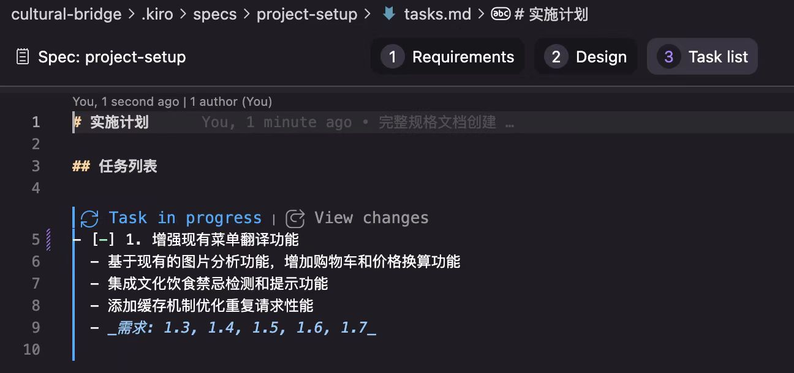
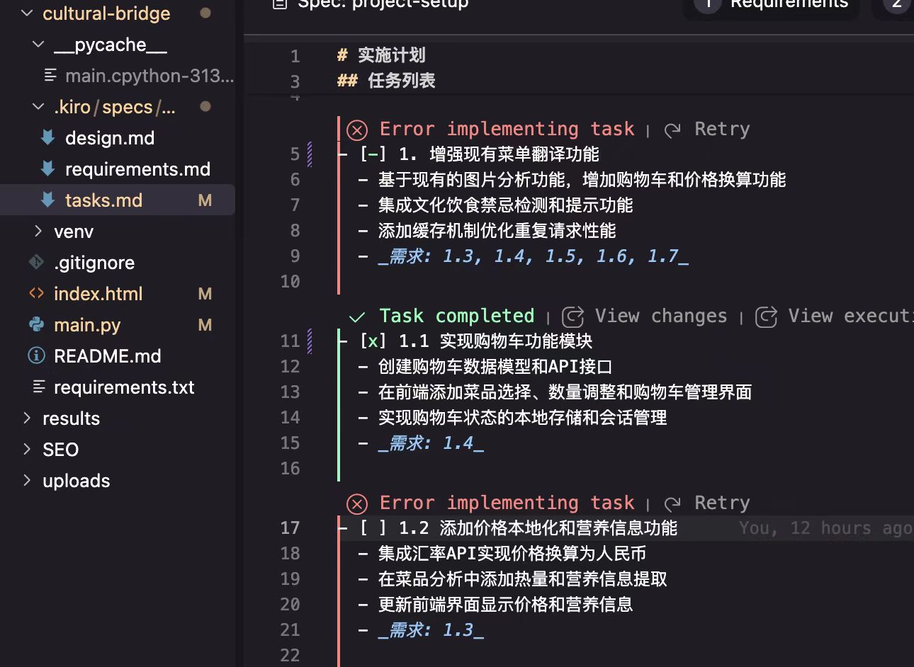

## Vibe Coding IDEs brief comparison

> Author: [Koutian Wu](https://www.linkedin.com/in/ktwu01/); [GitHub](https://github.com/ktwu01/) 290 stars

> TL;DR 太长不看版本
> Vibe coding 重度使用者, 比如说我, 为了多快好省的 hao 羊毛, 在老板不给 API 的情况下, 建议全部都用。
> Vibe coding 轻微使用者, 如果你是学生你可以用 Cursor 学生会员, 拥有最强大的 vibe coding 功能. Kiro / Antigravity 无需验证, 直接 google帐号注册就可以用, 是最方便上手的。

> Disclaimer: 首先，我非常感谢这几家IDE，要么我有学生会员，要么是免费使用，我都没有花钱。免费使用的生产力工具，我没有资格进行批评hhh，所以下面只是我一些个人的使用经验探讨。

我没正经用Trae作生产工具，Vibe Coding IDE只用过VS Code，Cursor，AWS Kiro，Google Antigravity。 使用这么多的原因不是"差生文具多"，而是Cursor的学生会员免费额度+ Claude Code + Gemini CLI + Codex 加起来都不够用。 Claude Code + Gemini CLI + Codex 可能会放到下一期来聊几句。

Cursor花活多，各套vibe coding配置最全。设计比较细心。
> 比如说，可以选择多个模型 在不同的 git worktree一起思考。
> 
> 比如说这里可以选择是“revert”，也可以选择不“revert”。 留给用户更自主的选择，是尊重用户智商的表现。其他几家都强制默认“revert”, 我个人觉得这不好。

Kiro适合免费用Claude模型, 对每个新注册的用户, 不需要验证, 直接提供500个credit. 使用多个Google/AWS/账号薅，但是它只提供Claude的模型，包括Opus4.5

Kiro 刚出来的时候，最大的的特色是他的spec功能， 可以选择“fast”，也可以选择先出very detailed plan再执行，但是现在其他家也有类似功能。

Kiro相比Cursor一大优点是，在设置 允许自动运行的命令的 allowlist的时候，可以在UI里面手动选择 allow 命令的哪一段. Cursor 是不能这样做的。
> e.g. In Kiro, You can choose from allow "git * " or "git add * ".

但是他们都有一个特别傻的时候，就是如果第一行是一个注释，他们会让你选择把一个注释加到 allowlist 里面。
> e.g. Choose if you wanna add "# This code is for xxx" to allowlist

Kiro 一个缺点是，LLM对话超过最大内容限度之后，会强制性summarize，然后跳到另外一个对话窗口，而不是像Cursor那样在同一个窗口summarize。如果你对话很长的话，就会出现这样的情况: 你会看到不停地有新的对话出来，而且它们的标题没有任何意义。

Google的 Antigravity 反倒是不仅限于自家模型，免费提供了Gemini Pro high, GPT OSS, Claude Opus 4.5. 这真的可以算是海纳百川，天地良心了。

Antigravity 它有一个非常贴心的功能，它默认情况下不会在你的代码库里面创建那么多乱七八糟的仓库介绍。 但是他仍然默认会拉屎。 不会在你的代码库里面拉屎；它会在它自己的库(brain)里面拉屎。 是的，希望不要满脑子都是屎。

总的来说，我觉得 Antigravity 还是挺好用的。而且选择 Gemini 模型，它思考的速度比其他几个更快一些。当然，可能只是我没有怎么用它作为生产力工具，所以产生了系统性观察偏差。

## 总结

每一家都有每一家的好处。
Vibe coding 重度使用者, 比如说我, 为了多快好省的 hao 羊毛, 在老板不给 API 的情况下, 建议全部都用。
Vibe coding 轻微使用者, 如果你是学生你可以用 Cursor 学生会员, 拥有最强大的 vibe coding 功能. Kiro / Antigravity 无需验证, 直接 google帐号注册就可以用, 是最方便上手的。

最后祝 LLM/IDE 厂商们大家多多打起来，这样我们可以持续使用免费的IDE。

> 看到文章的朋友不要转发, 知道这个羊毛的人太多之后, 羊毛的活动福利就没有了
