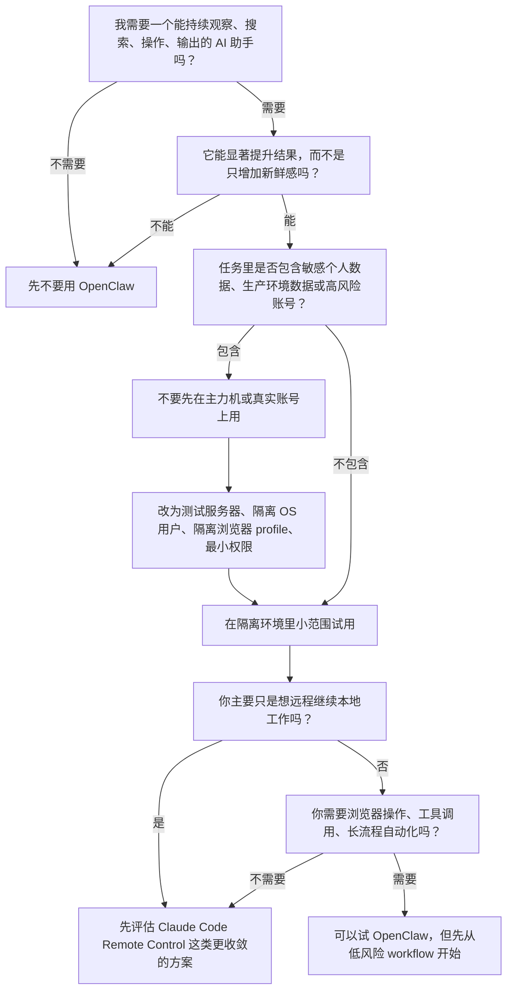

## 用不用 OpenClaw：一个简单决策图

说到底，OpenClaw 不是一个“所有人都该立刻装”的工具。更准确地说，它是一个杠杆很大、但操作面也更大的系统。

如果它不能明显提升你的结果，或者你的环境里本来就有大量敏感数据，那就不应该因为它火就硬上。更稳妥的方式，是先在测试服务器、隔离账户、隔离浏览器 profile 里跑，再慢慢扩大权限。



这张图背后的逻辑其实很简单：

- 不提升结果，就不要用。
- 不够安全，就不要碰自己的敏感数据。
- 能用隔离环境，就不要一开始就上生产环境。
- 如果你只需要“远程继续做本地工作”，那类需求未必一定要上 OpenClaw 这么宽的操作面。

如果你在美国做 AI 相关工作，不管你更偏工程、增长、研究、内容还是运营，这几年都会越来越强烈地感受到一件事：真正拉开差距的，已经不只是你会不会用模型，而是你能不能把模型接进日常工作流。

很多人现在对 AI 的使用方式，依然停留在“开个聊天窗口，问一个问题，复制一段答案”。这当然有用，但还是太浅了。更强的一层，是让 AI 不只是回答问题，而是接进你的命令行、你的脚本、你的数据源、你的定时任务、你的通知系统，开始持续地替你观察、整理、生成和提醒。

这也是我觉得 OpenClaw 很有意思的地方。它不是单纯再造一个聊天框，而是在尽量把几乎所有能跑在 command line 上的东西接到同一个 agent 工作流里。做到这一步以后，AI 才更像一个真正的第二大脑，而不只是一个偶尔帮你写几句文字的助手。

## 先装起来：OpenClaw 的最小可用配置

如果你第一次上手，最简单的路径就是先把 OpenClaw 装起来，然后确认本地 Gateway 和控制面板能工作。

根据当前官方文档，OpenClaw 推荐的安装方式是：

```bash
curl -fsSL https://openclaw.ai/install.sh | bash
```

装好以后，直接跑初始化向导：

```bash
openclaw setup --wizard --install-daemon
```

这一步通常会帮你完成几件关键事情：

1. 配置本地 Gateway
2. 选择模型和认证方式
3. 设置默认 workspace
4. 安装后台 daemon，让它持续运行
5. 按需连接消息渠道或其他集成

OpenClaw 文档里给出的默认 workspace 是：

```bash
~/.openclaw/workspace
```

默认 Gateway 端口是：

```bash
18789
```

配好之后，可以先检查 Gateway 状态：

```bash
openclaw gateway status
```

然后打开控制面板：

```bash
openclaw dashboard
```

如果浏览器能打开本地 Control UI，说明最小闭环已经跑起来了。对大多数 AI worker 来说，这已经足够开始做第一批真正有杠杆的事情。

如果你后面想调整配置，而不是全部重装，可以继续用：

```bash
openclaw configure
```

我会建议美国这边做 AI 工作的人，第一次配置时优先把这几件事想清楚：

- 你准备让它连接哪些模型和 API
- 你想把哪些脚本、抓取、搜索、summary 工作变成长期工作流
- 你需要哪些通知出口，例如 dashboard、Telegram、WhatsApp 或其他消息渠道
- 哪些任务要实时交互，哪些任务其实更适合 daemon + cron + webhook

一旦这里配置好，OpenClaw 的价值就不再只是“会聊天”，而是“会持续工作”。

## 为什么它更像第二大脑，而不是又一个 AI 工具

我越来越觉得，一个 AI 系统要想真的融入工作，不是看它能不能说漂亮话，而是看它能不能接进你已经在用的世界。

命令行的好处就在这里。很多真正有生产力的东西，本来就已经在 CLI 上了：

- 搜索脚本
- 数据抓取
- RSS 和网页监控
- 邮件和通知自动化
- CRM 或表格同步
- 定时任务
- 内容生成流水线
- Git、文档、数据库和内部工具

如果一个 agent 能比较自然地调用这些能力，它就不只是一个“问答模型”，而会开始变成一个工作系统。你给它一个目标，它可以自己去找资料、跑脚本、生成中间结果、输出日报，甚至把需要你拍板的部分再回推给你。

这个结构特别适合美国很多 AI worker 的现实处境。因为这边大量岗位本来就要求一个人同时覆盖很多事情：研究一点、写一点、做增长一点、跑销售一点、盯内容一点、搭自动化一点。你如果每次都手动切换上下文，精力会碎得非常快。

OpenClaw 这种 agent layer 的价值，就是帮你把这些碎片重新接起来。

## 1. 搜新想法，也搜赚钱机会

大多数人说“我想用 AI 提升效率”，其实说得太轻了。更值得做的是：让 AI 帮你找新的 alpha。

这里的 alpha 可以是很多东西：

- 新的创业切口
- 新的 AI SaaS 机会
- 新的咨询/服务型业务机会
- 某个 vertical market 刚刚出现的需求
- 某些还没被卷烂的分发渠道
- 新的合作方、客户、雇主或者研究方向

OpenClaw 真正有意思的地方，在于你可以把“搜索”从一次性动作，变成一个持续运行的系统。

比如你可以让它：

- 定期搜索某个行业最近一周的新产品、新融资、新招聘趋势
- 监控 X、Reddit、Hacker News、Product Hunt、GitHub 和新闻源
- 把原始信息先去噪，再输出成你看得懂的机会清单
- 用你自己的标准打标签，例如“短期能做 consulting”“适合做 content funnel”“适合做垂直 agent”

这和单纯问一句“最近有什么 AI 创业机会？”完全不是一回事。

前者是在建立机会雷达。后者只是在消费一个答案。

对个人创业者、独立开发者、AI PM、research engineer、growth operator 来说，这种差别很大。很多人不是没有能力，而是机会扫描密度太低，导致总在做别人早就做过的东西。

如果 OpenClaw 能持续替你扫市场、扫用户情绪、扫工具链变化，它就开始像一个永不疲倦的侦察兵。

## 2. 帮你盯住新的可能性和窗口期

很多机会不是因为你不会做，而是因为你太晚知道。

一个新的 API 放出来，一个新的模型价格暴跌，一个新的集成刚支持企业场景，一个竞争对手开始转向，一个行业突然开始招同一类人，这些都可能意味着窗口打开了。

但现实是，大部分人每天已经被会议、交付、Slack、邮件、PR、文档拖得很散，根本没有稳定精力持续盯这些变化。

这就是第二个很实际的用法：让 OpenClaw 做“机会监控器”。

你可以让它长期观察：

- 你所在细分市场的招聘变化
- 某类关键词的新闻和论坛讨论
- 竞争对手的官网、定价页、更新日志和职位描述
- 某些重点客户群体最近在抱怨什么
- 新 release、新 benchmark、新开源项目里哪些东西值得立刻试

然后不要让它只给你原始链接，而是直接输出：

- 什么变了
- 为什么值得关注
- 这可能意味着什么
- 你今天应该做什么动作

这一步非常重要。因为真正值钱的不是信息，而是被解释过、能进入行动的信号。

如果你让 OpenClaw 每天早上给你一份“新机会简报”，你对市场的敏感度会和普通人完全不一样。时间一长，它会帮你形成一种结构性优势：你总是比别人早半步注意到新的东西。

## 3. 帮你制造新的工作岗位，而不是只适配旧岗位

我越来越觉得，AI 时代很多好机会不是“投现有岗位”，而是“把自己塑造成一个新的岗位”。

很多公司一开始并不知道自己需要什么人。它们只是模糊地知道：

- 需要有人持续写 daily update
- 需要有人做 inbound marketing
- 需要有人维护创始人内容分发
- 需要有人把研究、产品、销售和市场信息串起来
- 需要有人把零散信息变成可执行的运营系统

这时候，OpenClaw 的价值就不只是帮你省时间，而是帮你设计一种原本不存在、但公司会愿意为之付费的工作形态。

例如你可以用它搭出一整套个人工作流：

- 每天自动汇总行业新闻，生成 founder update 或 operator brief
- 从客户对话、表单、社区讨论中提炼常见问题，再生成内容选题
- 把博客、播客、推文、邮件改写成不同渠道版本
- 把 inbound lead 的公开信息先做预研，生成第一版客户画像
- 把研究材料、市场动态和产品更新汇总成一份内部 memo

当你能稳定交付这些东西时，你卖的就不再只是“我会写字”或者“我会用 AI”。

你卖的是一种更高层的能力：**我能帮你持续制造信息优势、内容优势和行动优势。**

很多所谓新岗位，本质上就是这样被做出来的。不是 HR 先写好 JD，你再去匹配；而是你先把一个有价值的工作系统跑通，再让别人意识到：这个位置应该存在。

## 4. Daily updates、inbound marketing，以及所有可重复的内容工作

这是 OpenClaw 最容易立刻产生 ROI 的地方。

很多 AI worker 的日常其实不是高深建模，而是大量重复但重要的“整理类劳动”：

- 写日报、周报、月报
- 整理会议结论
- 总结客户反馈
- 跟踪销售对话
- 维护博客、newsletter、社媒更新
- 把长内容拆成短内容
- 把技术内容翻译成业务语言

这些事情如果全靠人脑硬切，很容易拖延，也很容易质量不稳定。

但如果你把它们拆成一串可重复步骤，OpenClaw 就能接上：

1. 拉取原始信息
2. 做第一轮清洗和分类
3. 生成不同格式的草稿
4. 按不同受众改写
5. 推送给你审阅或直接发到指定渠道

这对 inbound marketing 尤其重要。因为 inbound 真正难的，不是偶尔写一篇爆文，而是持续稳定地产出：

- 可搜索的内容
- 可复用的观点
- 可分发的素材
- 可积累的品牌记忆

OpenClaw 如果接好了搜索、抓取、草稿、改写、排期和通知，基本就能承担一个轻量级内容运营系统的骨架。

你自己只需要把精力放在两件更值钱的事上：判断方向，以及做最后一层质量把关。

## 5. 最重要的一点：让 AI 从工具变成长期系统

为什么我会觉得这类东西重要？因为 AI 真正的杠杆，越来越不在单次 prompt，而在长期系统。

一次 prompt 能帮你省十分钟。

一个接上命令行、搜索、通知、定时任务和内容流水线的 agent，可能会持续帮你创造新的观察能力、新的收入机会、新的工作方式，甚至新的岗位定义。

这就是“第二大脑”真正应该指的东西。不是一个会背答案的模型，而是一个能帮你长期记忆、长期观察、长期输出、长期提醒、长期协作的系统。

OpenClaw 未必自动替你做出判断，但它可以把大量低杠杆的信息摩擦先吸掉，让你把注意力集中在更值钱的地方：

- 哪个机会值得下场
- 哪个市场值得追
- 哪个内容值得长期做
- 哪种客户值得服务
- 哪条职业路径值得自己主动造出来

如果你在美国做 AI 相关工作，我会很推荐至少试一次这种工作流。不是因为它听起来前沿，而是因为它很现实。今天真正占便宜的人，往往不是最会谈论 AI 的人，而是最早把 AI 接进自己操作系统的人。

OpenClaw 的意义，也许就在这里：它让你第一次有机会，把本来散落在浏览器标签、命令行脚本、搜索结果、日报草稿和临时灵感里的东西，慢慢接成一个连续运转的外脑。
