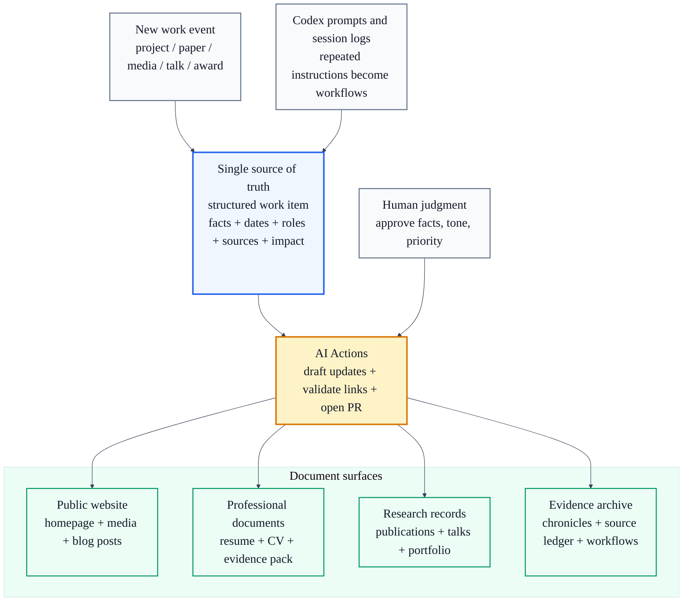

# Document Flow Graph

This diagram maps the current document flow from new work events and session logs into website, resume, evidence, and project surfaces.

```mermaid
%%{init: {"theme": "base", "themeVariables": {"background": "#ffffff", "fontFamily": "Inter, Arial, sans-serif", "fontSize": "24px", "primaryTextColor": "#111827", "lineColor": "#334155", "primaryColor": "#eff6ff", "primaryBorderColor": "#2563eb", "secondaryColor": "#f8fafc", "tertiaryColor": "#ecfdf5"}, "flowchart": {"curve": "basis", "nodeSpacing": 70, "rankSpacing": 85}}}%%
flowchart TD
    WorkEvent[New work event<br/>project / paper / media / talk / award]
    SessionLogs[Codex prompts and session logs<br/>repeated instructions become workflows]
    SourceTruth[Single source of truth<br/>structured work item<br/>facts + dates + roles + sources + impact]
    HumanReview[Human judgment<br/>approve facts, tone, priority]
    AIAction[AI Actions<br/>draft updates + validate links + open PR]

    WorkEvent --> SourceTruth
    SessionLogs --> SourceTruth
    SourceTruth --> AIAction
    HumanReview --> AIAction

    subgraph Outputs[Document surfaces]
        Website[Public website<br/>homepage + media + blog posts]
        Professional[Professional documents<br/>resume + CV + evidence pack]
        Research[Research records<br/>publications + talks + portfolio]
        Archive[Evidence archive<br/>chronicles + source ledger + workflows]
    end

    AIAction --> Website
    AIAction --> Professional
    AIAction --> Research
    AIAction --> Archive

    classDef input fill:#f8fafc,stroke:#64748b,stroke-width:2px,color:#111827;
    classDef core fill:#eff6ff,stroke:#2563eb,stroke-width:3px,color:#111827;
    classDef action fill:#fef3c7,stroke:#d97706,stroke-width:3px,color:#111827;
    classDef output fill:#ecfdf5,stroke:#059669,stroke-width:2px,color:#111827;
    class WorkEvent,SessionLogs,HumanReview input;
    class SourceTruth core;
    class AIAction action;
    class Website,Professional,Research,Archive output;
```
